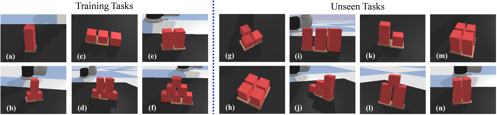

# Ravens-Visual-Foresight - Transporters with Visual Foresight for Solving Unseen Rearrangement Tasks

Ravens-Visual-Foresight is a repository for Transporters with Visual Foresight (TVF).
It contains a collection of multi-steps block rearrangement tasks.
TVF is able to achieve multi-task learning and zero-shot generalization to previously unseen tasks when given only handful of expert demonstrations.
TVF enables robots to imagine the next-step observation image after taking a pick-and-place action in SE(2) space.
The code is heavily based on the origin [ravens repository](https://github.com/google-research/ravens) and [deformable-ravens repository](https://github.com/DanielTakeshi/deformable-ravens).
The code has been tested on Ubuntu 20.04 and Python 3.8.
If you have any questions, please use the issue tracker.

<p align="center">


</p>

<br>

The tasks used for training include:

(a) **stack-tower (Tower)**: stack a tower with 3 blocks on a base with 3 positions.<br>
(b) **stack-t (Inverse T-shape)**: stack an inverse T-shape with 4 blocks on a base with 2 positions.<br>
(c) **put-block-base (Row)**: put 3 blocks on a base with 3 positions.<br>
(d) **stack-palace (Palace)**: stacks 7 blocks to a palace of 3-2-2 on a base with 3 positions.<br>
(e) **stack-square (Square)**: stack a 2x2 square on a base with 2 positions.<br>
(f) **stack-pyramid (Pyramid)**: stack 6 blocks to a pyramid of 3-2-1 on a base with 3 positions.<br>

The previously unseen tasks include:

(g) **put-t (Plane T)**: put 3 blocks on a T-shape base. <br>
(h) **put-plane (Plane Square)**: put 4 blocks on a square base. <br>
(i) **stack-rectangle (Rectangle)**: stack 6 blocks to a rectangle shape on a base with 3 positions. <br>
(j) **stack-big-stair (Stair 3)**: stack 6 blocks to a three-stage stair on a base with 3 positions. <br>
(k) **stack-stair (Stair 2)**: stack 3 blocks to a two-stage stair on a base with 2 positions. <br>
(l) **stack-building (Building)**: stack 5 blocks to a building shape on a base with 2 positions. <br>
(m) **stack-pallet (Pallet)**: stack 8 blocks to a 2x2x2 shape on a square base with 4 positions. <br>
(n) **stack-twin-tower (Twin Tower)**: stack 6 blocks to a twin tower on a base with 2 positions. <br>

All tasks requires multi-step sequencing with close-loop feedback.

This is the reference repo for the paper:
### Transporters with Visual Foresight for Solving Unseen Rearrangement Tasks

[Project Website](https://chirikjianlab.github.io/tvf/) || [Paper Link](https://arxiv.org/abs/2202.10765) || IROS 2022

*[Hongtao Wu](https://hongtaowu67.github.io/)\*, Jikai Ye\*, Xin Meng, [Chris Paxton](https://cpaxton.github.io/about/), [Gregory Chirikjian](https://cde.nus.edu.sg/me/staff/chirikjian-gregory-s/)*

\* indicates equal contribution.

Rearrangement tasks have been identified as a crucial challenge for intelligent robotic manipulation, but few methods allow for precise construction of unseen structures. We propose a visual foresight model for pick-and-place rearrangement manipulation which is able to learn efficiently. In addition, we develop a multi-modal action proposal module which builds on the Goal-Conditioned Transporter Network, a state-of-the-art imitation learning method. Our image-based task planning method, Transporters with Visual Foresight, is able to learn from only a handful of data and generalize to multiple unseen tasks in a zero-shot manner. TVF is able to improve the performance of a state-of-the-art imitation learning method on unseen tasks in simulation and real robot experiments. In particular, the average success rate on unseen tasks improves from 55.4\% to 78.5\% in simulation experiments and from 30\% to 63.3\% in real robot experiments when given only tens of expert demonstrations. 


## Installation
- Install Nvidia Driver and CUDA

- Follow the installation steps in [the deformable_ravens_vf repo](https://github.com/ChirikjianLab/deformable_ravens_vf) to install the deformable_ravens_vf package. This package serves as the multi-modal action proposal module for TVF.

- As an example for Ubuntu 20.04:
  ```shell
  sudo apt install gcc libgl1-mesa-dev python3.8-venv
  python3.8 -m venv ./venv
  source ./venv/bin/activate
  pip install -U pip
  pip install scikit-build
  pip install -r ./requirements.txt
  export PYTHONPATH=${PWD}
  ```

## Getting Started

- Generate training and testing data (saved locally). The `--disp` flag will enable visualization. Remove `--disp` for headless mode. The `--random` flag enables random action collection for training the visual foresight model. To collect training data:
  ```shell
  python ravens/demos_tvf.py --data_dir=./data_train --disp=True --task=put-block-base --mode=train --n=1000 --random=True
  ```
  The data will be saved in `./data_train`.  Collect the training data for **all** the six training tasks. To collect test data:
  ```shell
  python ravens/demos_tvf.py --data_dir=./data_test --disp=True --task=put-t --mode=test --n=20 --random=False
  ```
  The data will be saved in `./data_test`.

- Train the visual foresight model. `--n_demos` specifies the number of demos used for training for *each* training task. `--n_steps` indicates the number of training steps. The batch number for each step is 1. `--n_runs` specifies the number of training runs. The trained model will be saved in `./dynamics_model/vf_{n_demos}`. 
  ```shell
  python ravens/train_pp_dynamics.py --data_dir=./data_train --n_demos=10 --n_steps=60000 --n_runs=1
  ```

- Train the GCTN for the multi-modal action proposal. Please refer to the [deformable_ravens_vf repo](https://github.com/ChirikjianLab/deformable_ravens_vf) to train the GCTN.

- Evaluate TVF on the test data of a task. `--method` indicates the method. You may select **tvf-large** or **tvf-small**. `--task` specifies the testing task. `--n_demos` specifies the number of demos used for each training task in training. `--n_runs` specifies the number of training runs.
  ```shell
  python ravens/test_tvf.py --data_dir=./data_test  --method=tvf-large --task=stack-big-stair --disp=True --n_demos=10 --n_runs=1
  ```

- Evaluate the visual foresight (VF) model on the test data of all testing/training tasks. You may set ```task_set``` as ```training``` or ```unseen``` to test on different sets of tasks.
  ```shell
  python ravens/test_pp_dynamics.py --data_dir=./data_test --task_set=unseen --n_demos=10 -n_runs=1
  ```

## Datasets and Pre-Trained Models

You may also download the pre-generated [training data](https://drive.google.com/file/d/1GNDvMdAVK3_psc1vWzlTxYT6rSSDGDoz/view?usp=sharing), [test data](https://drive.google.com/file/d/1gmqYGCCvnnidk5MnMME64-ZNLreH8QTp/view?usp=sharing) and [pre-trained models](https://drive.google.com/file/d/1CVUT7NDE24SvpJaS02PuUKaT2a95Pd9b/view?usp=sharing).
Then, decompress the zips containing the data and the models in the root directory. 
You should get a directory structure similar to the following
```shell
├── ravens_visual_foresight
│   ├── ravens
│   ├── data_train
│   ├── data_test
│   ├── dynamics_models
│   ├── gctn_models
...
```

## Related Work

- [Learning to Rearrange Deformable Cables, Fabrics, and Bags with Goal-Conditioned Transporter Networks](https://arxiv.org/abs/2012.03385)

- [Transporter Networks: Rearranging the Visual World for Robotic Manipulation](https://arxiv.org/abs/2010.14406)

## Citation
If you find this code useful in your work, please consider citing
```shell
@article{wu2022transporters,
  title={Transporters with Visual Foresight for Solving Unseen Rearrangement Tasks},
  author={Wu, Hongtao and Ye, Jikai and Meng, Xin and Paxton, Chris and Chirikjian, Gregory},
  journal={arXiv preprint arXiv:2202.10765},
  year={2022}
}
```